# Install OpenCV for Window

1.DownLoad OpenCV Window Version

2.extract OpenCV file

3.Set Path 

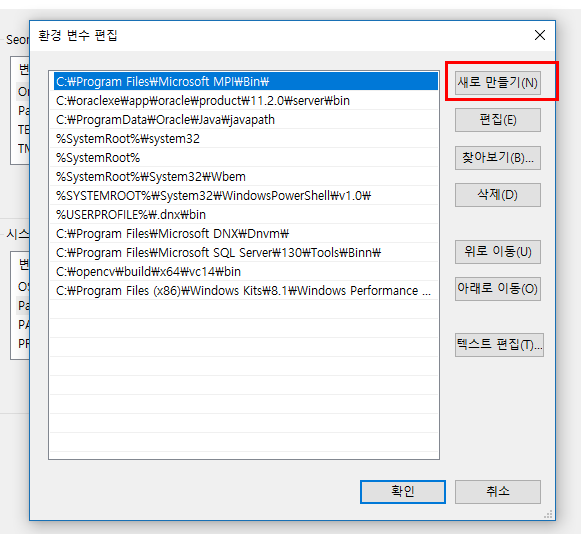
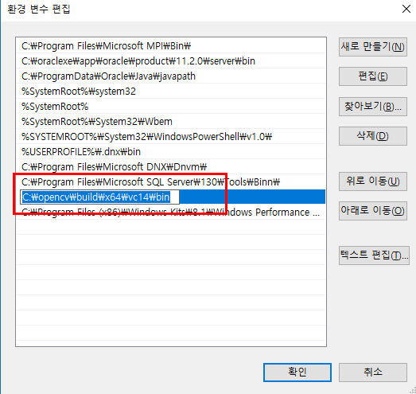

4. open VisualStudio and make Project

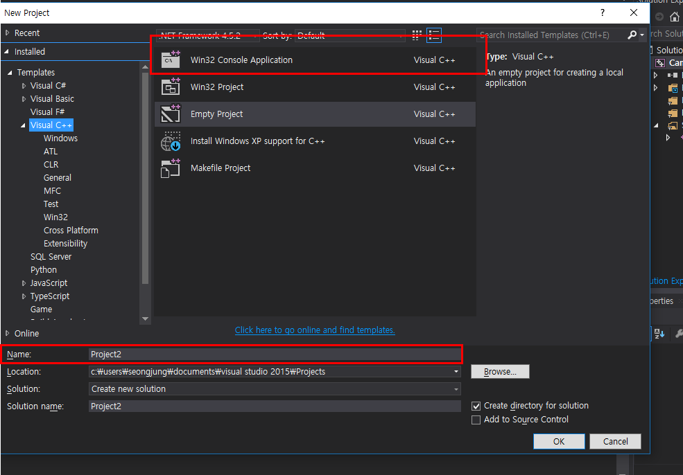
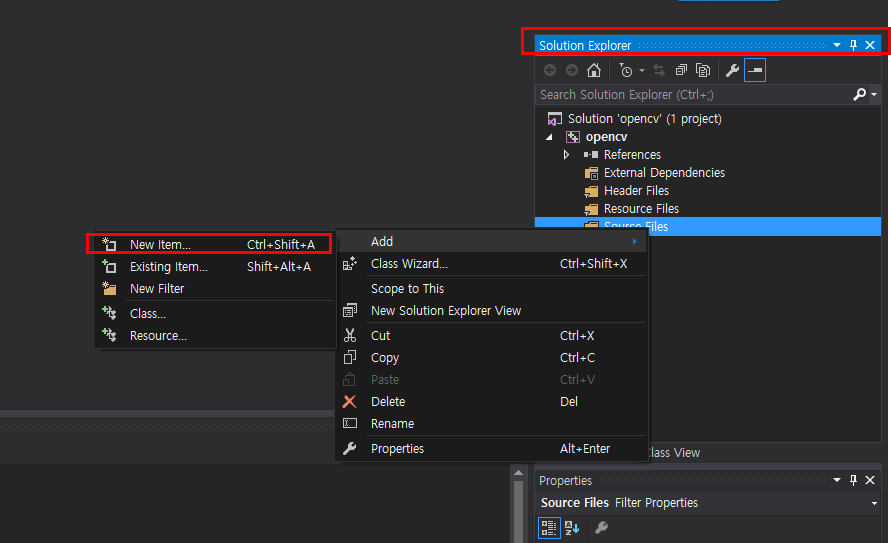

5. left click on project tap and go 'Properties'

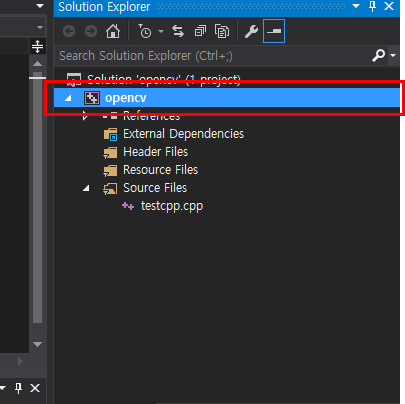
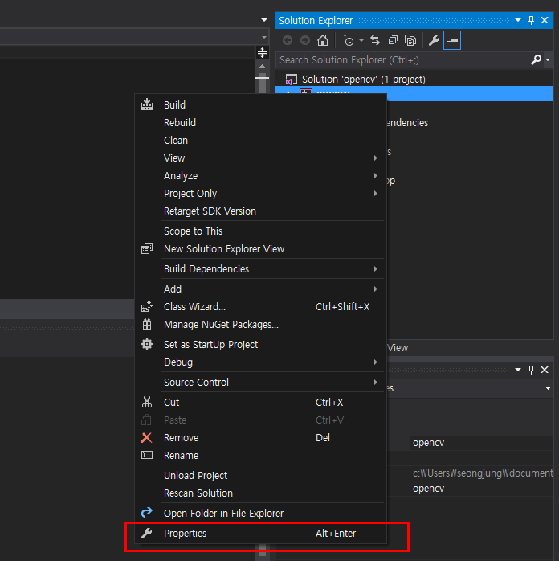

6. Set Project Enviroment Setting 

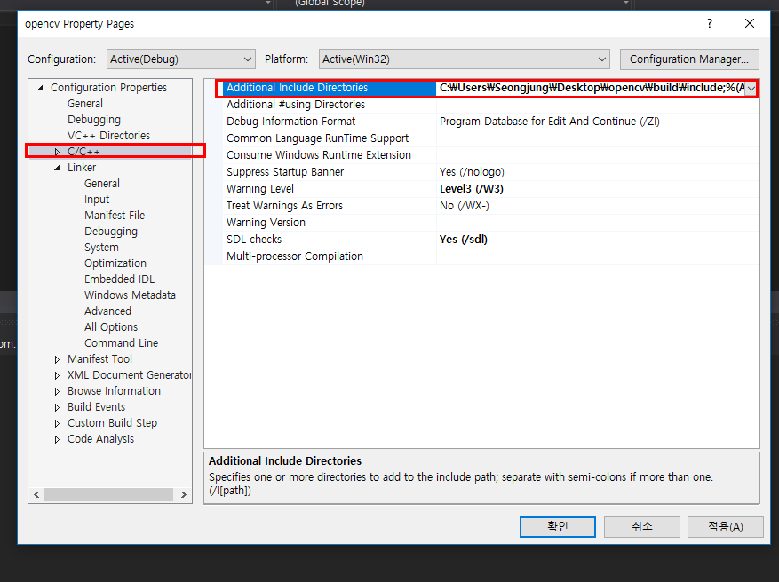
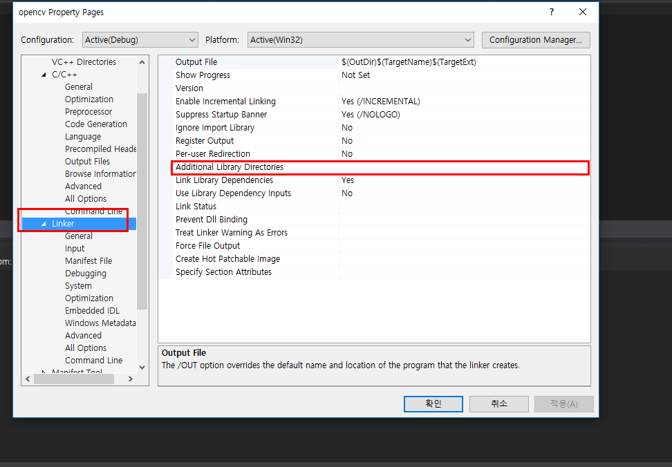
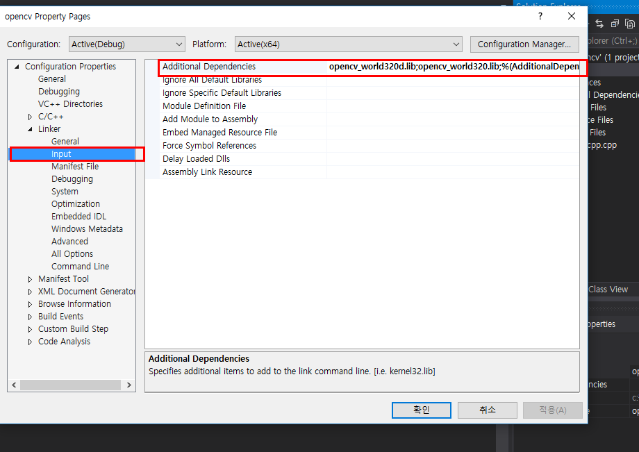
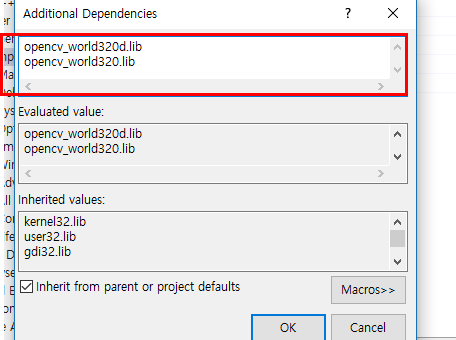
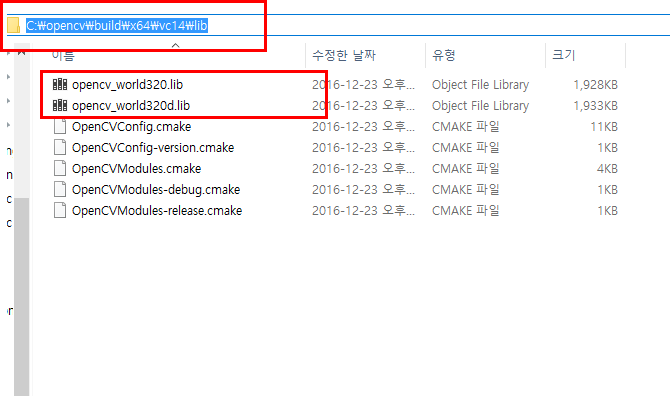

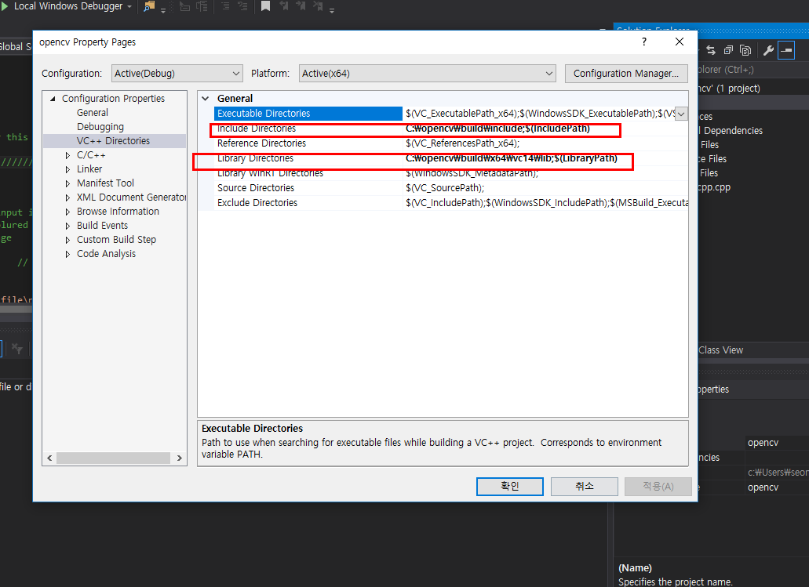
